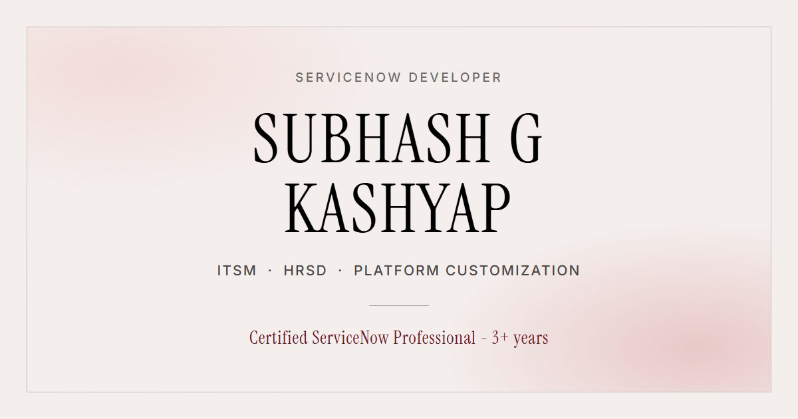

# Subhash G Kashyap - Portfolio

Personal portfolio site for a ServiceNow Developer working across ITSM, HRSD and
Platform Customization.

**Live:** https://your-site.netlify.app



## Stack

| | |
| --- | --- |
| Framework | React 19 + Vite 7 |
| Styling | Tailwind CSS v4 |
| Animation | Motion (Framer Motion) |
| Fonts | Instrument Serif + Inter, bundled locally |

The page makes **no third-party requests** at runtime - fonts are served from the site
itself rather than a CDN.

## Running it locally

```bash
npm install
```

```bash
npm run dev
```

Open the URL the terminal prints (usually http://localhost:5173).

```bash
npm run build
```

Builds to `dist/`. `npm run preview` serves that build locally.

## Structure

```
src/
  App.jsx              section order
  index.css            theme tokens, type styles, buttons
  data/content.js      all site copy in one file
  components/          one file per section, plus Artwork / Reveal / Typewriter
public/                images, resume PDF, favicon, share card
```

All text lives in [`src/data/content.js`](src/data/content.js) - edit that one file to
change what the site says.

## Deployment

Static build, deployed on Netlify. Pushing to `main` triggers a rebuild automatically.

- Build command: `npm run build`
- Publish directory: `dist`
